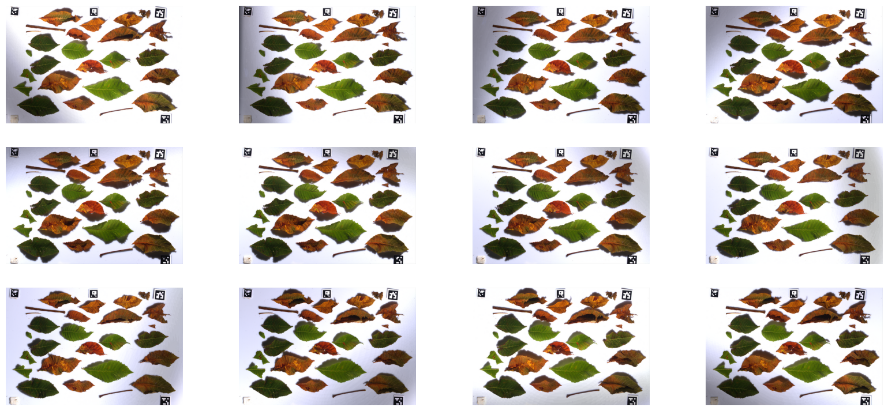
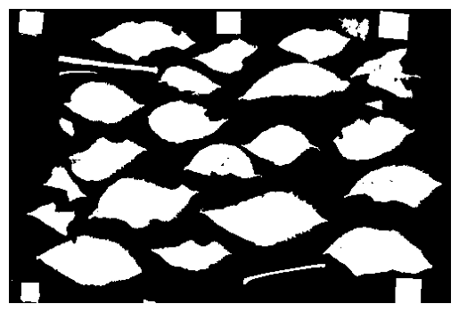
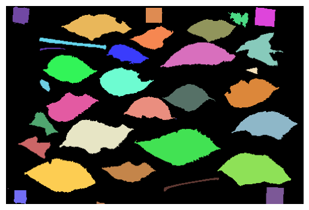
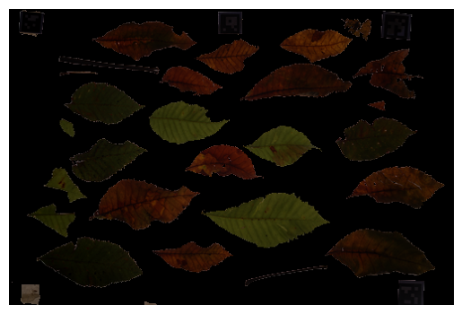
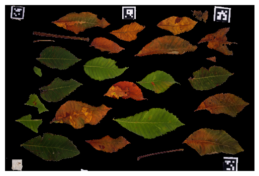
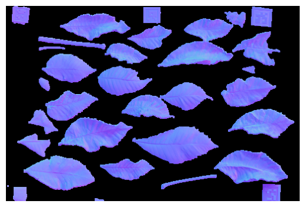
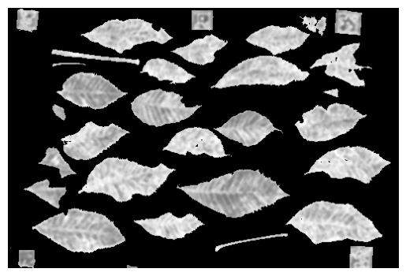
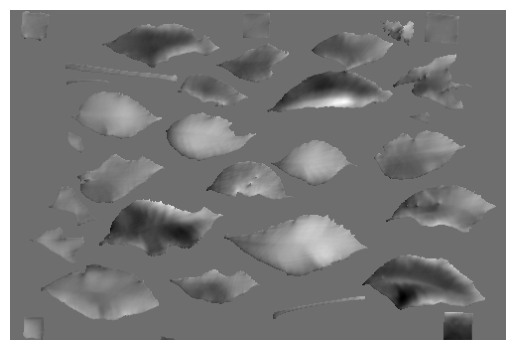

<!-- START doctoc generated TOC please keep comment here to allow auto update -->
<!-- DON'T EDIT THIS SECTION, INSTEAD RE-RUN doctoc TO UPDATE -->
**Table of Contents**

- [Load Test Data](#load-test-data)
- [Corrections & Preprocessing](#corrections--preprocessing)
  - [Lens Related Corrections](#lens-related-corrections)
    - [Vignette Correction](#vignette-correction)
    - [Distortion Correction](#distortion-correction)
    - [Transversal Chromatic Aberration (TCA) Correction](#transversal-chromatic-aberration-tca-correction)
  - [TDM Related Corrections](#tdm-related-corrections)
    - [Image Alignment](#image-alignment)
  - [Photonics Related Corrections](#photonics-related-corrections)
    - [Light Falloff Correction](#light-falloff-correction)
    - [White Balance](#white-balance)
- [Mappings](#mappings)
  - [Mask](#mask)
  - [Identifier Map](#identifier-map)
  - [Translucency Mapping](#translucency-mapping)
  - [Albedo Mapping](#albedo-mapping)
  - [Normal Mapping](#normal-mapping)
  - [Roughness Mapping](#roughness-mapping)
  - [Height Mapping](#height-mapping)
    - [Calculating the Gradients](#calculating-the-gradients)
    - [Calculating the Heights](#calculating-the-heights)
    - [Height map normalization](#height-map-normalization)
  - [Ambient Occlusion Mapping](#ambient-occlusion-mapping)
- [References](#references)

<!-- END doctoc generated TOC please keep comment here to allow auto update -->

# Load Test Data


If you want to run the repository in your local environment you just need to run this once with ``already_downloaded`` set to ``False``.
It will then download the test data automatically (into the folder ``TEST_DATA``). After that you can run this script with ``already_downloaded`` set to ``True``.


```python
from pathlib import Path
from natsort import natsorted
from utilities.image_file import read_image, show_image, show_images

TOP_LIGHT_IMAGES_PATHS = []
BOTTOM_LIGHT_IMAGES_PATHS = []
for image_path in Path("test_data").glob("*.png"):
    if "TL" in image_path.name:
        TOP_LIGHT_IMAGES_PATHS.append(image_path)
    elif "BL" in image_path.name:
        BOTTOM_LIGHT_IMAGES_PATHS.append(image_path)

TOP_LIGHT_IMAGES_PATHS = natsorted(TOP_LIGHT_IMAGES_PATHS, key=lambda y: y.name)
BOTTOM_LIGHT_IMAGES_PATHS = natsorted(BOTTOM_LIGHT_IMAGES_PATHS, key=lambda y: y.name)

TOP_LIGHT_IMAGES = [read_image(image_path) for image_path in TOP_LIGHT_IMAGES_PATHS]
BOTTOM_LIGHT_IMAGES = [
    read_image(image_path) for image_path in BOTTOM_LIGHT_IMAGES_PATHS
]

show_images(TOP_LIGHT_IMAGES)
```


    

    


# Corrections & Preprocessing


## Lens Related Corrections

Are applied per lens using lens specific calibration data.


### Vignette Correction


### Distortion Correction


### Transversal Chromatic Aberration (TCA) Correction


## TDM Related Corrections


### Image Alignment

from bit operations on median threshold bitmappings (MTB)[^1].

## Photonics Related Corrections

Are applied using enviroment specific calibration data.


### Light Falloff Correction

Is applied per light source using images with a diffuse plane.


```python
"""
from photonics.light_corrections import correct_light_falloff

LIGHT_FALLOFF_IMAGES = [read_image(path) for path in LIGHT_FALLOFF_IMAGES_PATHS]

TOP_LIGHT_IMAGES = correct_light_falloff(TOP_LIGHT_IMAGES, LIGHT_FALLOFF_IMAGES)
BOTTOM_LIGHT_IMAGES = correct_light_falloff(BOTTOM_LIGHT_IMAGES, LIGHT_FALLOFF_IMAGES)

del LIGHT_FALLOFF_IMAGES
show_images(TOP_LIGHT_IMAGES)
"""
```


    '\nfrom photonics.light_corrections import correct_light_falloff\n\nLIGHT_FALLOFF_IMAGES = [read_image(path) for path in LIGHT_FALLOFF_IMAGES_PATHS]\n\nTOP_LIGHT_IMAGES = correct_light_falloff(TOP_LIGHT_IMAGES, LIGHT_FALLOFF_IMAGES)\nBOTTOM_LIGHT_IMAGES = correct_light_falloff(BOTTOM_LIGHT_IMAGES, LIGHT_FALLOFF_IMAGES)\n\ndel LIGHT_FALLOFF_IMAGES\nshow_images(TOP_LIGHT_IMAGES)\n'


### White Balance

Is applied per light setup using a RGB based white balance when reading the RAW images.


# Mappings


## Mask
from Differently Lit Images with Edge Detection[^2].

There are currently three different types of datasets and thus, three different ways to create a mask:

1. **classic**: Mask is created using a combination of thresholds and adaptive thresholds as well as skeleton data to preserve fine details and contour detection to organize and sort out detected elements.
2. **light table**: Mask is created using a trivial threshold and contour detection to organize and sort out detected elements.
3. **frosted glass**: similar to light table


```python
from mappings.mask import mask_from_frosted_glass

OPACITY_MAP = mask_from_frosted_glass(BOTTOM_LIGHT_IMAGES)
OPACITY_MAP[OPACITY_MAP >= 255 / 1.5] = 255
OPACITY_MAP[OPACITY_MAP < 255 / 1.5] = 0

show_image(OPACITY_MAP)
```


    

    


## Identifier Map


```python
from mappings.identifier import identifier_map

IDENTIFIER_MAP, element_count = identifier_map(OPACITY_MAP)

print(f"Element count: {element_count}")
show_image(IDENTIFIER_MAP)
```

    Element count: 35


    

    


## Translucency Mapping
from Differently Lit Images with Exposure Fusion[^3].


```python
from mappings.translucency import translucency_map

TRANSLUCENCY_MAP = translucency_map(BOTTOM_LIGHT_IMAGES)
TRANSLUCENCY_MAP[OPACITY_MAP == 0] = [0, 0, 0]

show_image(TRANSLUCENCY_MAP)
```


    

    


## Albedo Mapping
from Differently Lit Images with Exposure Fusion[^3].


```python
from mappings.albedo import albedo_map

ALBEDO_MAP = albedo_map(TOP_LIGHT_IMAGES)
ALBEDO_MAP[OPACITY_MAP == 0] = [0, 0, 0]

show_image(ALBEDO_MAP)
```


    

    


## Normal Mapping
from Differently Lit Images with Photometric Stereo[^4].


```python
from mappings.normal import normal_map
from utilities.image_interpolation import (
    edge_extend_image,
)

NORMAL_MAP = normal_map(TOP_LIGHT_IMAGES)
NORMAL_MAP[OPACITY_MAP == 0] = [0, 0, 0]
NORMAL_MAP = edge_extend_image(NORMAL_MAP, OPACITY_MAP, 1)

show_image(NORMAL_MAP)
```


    

    


## Roughness Mapping

from the Neighbor-Variance of the Normals.


```python
from mappings.roughness import roughness_map

ROUGHNESS_MAP = roughness_map(NORMAL_MAP, OPACITY_MAP)

show_image(ROUGHNESS_MAP)
```


    

    


## Height Mapping

The height map is calculated using a 3d integral over the gradients of the normals on the normal map. The gradients are calculated by weighting vertical and horizontal gradient values based on a rotation value. The height map gains accuracy when using multiple rotation values and combining the integrated gradient values to a single height value per pixel.

### Calculating the Gradients

Given the normal vector $\vec{n} \in \mathbb{R}^{3}$ and a rotation value $r \in \mathbb{R}[0,2\pi]$, the anisotropic gradients are calculated:

$$
a_h = \arccos{\vec{n_x}}, \hspace{5px} g_l = (1 - \sin{a_h}) * sgn(a_h - \frac{\pi}{2})
$$

$$
a_v = \arccos{\vec{n_y}}, \hspace{5px} g_t = (1 - \sin{a_v}) * sgn(a_v - \frac{\pi}{2})
$$

This will be calculated for every pixel and for every rotation value.

### Calculating the Heights

The height values $h(x,y) \in \mathbb{R}^{2}, \ \ x,y \in \mathbb{N}^{0}$ can be calculated by a simple anisotropic cumulative sum over the gradients which converges to an integral over $g(x,y)$:

$$
h(x_t,y_t) = \int\int g(x,y) dydx \ \ (x_t,y_t) \approx \sum_{x_i=0}^{x_t} g(x_i,y_t)
$$

This alone is very prone for errors. That’s why the rotation is introduced. When re-calculating the gradient map multiple times with a rotation factor and using that to calculate the height values for every re-calculated gradient map, adding this values together drastically improves the resulting height values:

$$
h(x_t,y_t) = \sum_{r=0}^{2\pi} \sum_{x_i=0}^{x_t} g(r)(x_i,y_t)
$$


### Height map normalization
To make all the height maps comparable, the height map is not normalized per height map, but per fixed height. In theory this means that all height maps are divided by the same factor, but in practice there is a little caveat to that: Not all datasets are captured with the same focal length. Thus, a slope of 45° in one normal map pixel does not result in the same height on every dataset, because the effective length of a single pixel does not correspond to the same real world length. To counteract this problem another factor is introduced: The texel density (pixels per meter, $\frac{px}{m}$).

The texel density $t$ is calculated given the distance between the camera and the object $\Delta h$ and the sensor width $w_{c}$ and the focal length $f_{c}$ of the camera. The sensor width and the focal length is used to calculate the angle of view $\theta_{c}$ of the camera:

$$
\theta_{c} = 2 * \arctan{\frac{w_{c}}{2f_{c}}}
$$

Given the angle of view $\theta_{c}$ and the distance of camera and object $\Delta h_{c}$ (in other words: the height of the camera), we can calculate the actual width of the scan area (camera viewing width) $a_{w}$:

$$
a_{w} = 2 \Delta h_{c} \tan{\frac{\theta_{c}}{2}}
$$

This and the image width in pixel $i_{w}$ directly leads us to the texel density $t$:

$$
t = \frac{i_{w}}{a_{w}}
$$


```python
from mappings.height import height_map

HEIGHT_MAP = height_map(NORMAL_MAP, OPACITY_MAP, height_divisor=50)

show_image(HEIGHT_MAP)
```


    

    


## Ambient Occlusion Mapping
from Height Mapping with ray-traced baking.

# References

[^1]: Ward, Greg. "Fast, robust image registration for compositing high dynamic range photographs from hand-held exposures." Journal of graphics tools 8.2 (2003): 17-30.

[^2]: Canny, John. "A computational approach to edge detection." IEEE Transactions on pattern analysis and machine intelligence 6 (1986): 679-698.

[^3]: Mertens, Tom, Jan Kautz, and Frank Van Reeth. "Exposure fusion." 15th Pacific Conference on Computer Graphics and Applications (PG'07). IEEE, 2007.

[^4]: Woodham, Robert J. "Photometric method for determining surface orientation from multiple images." Optical engineering 19.1 (1980): 139-144.
